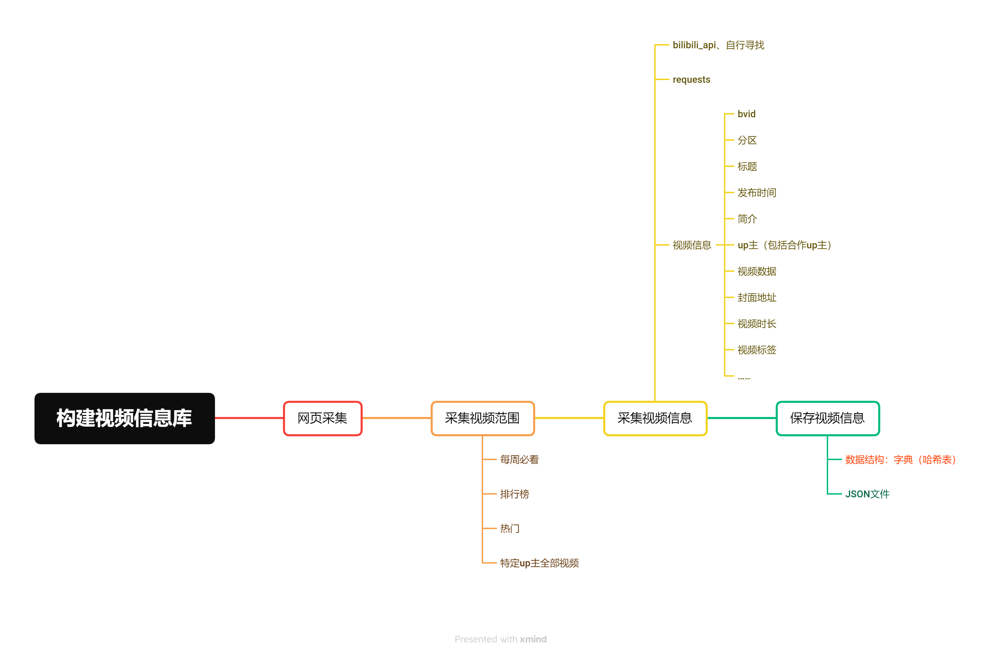
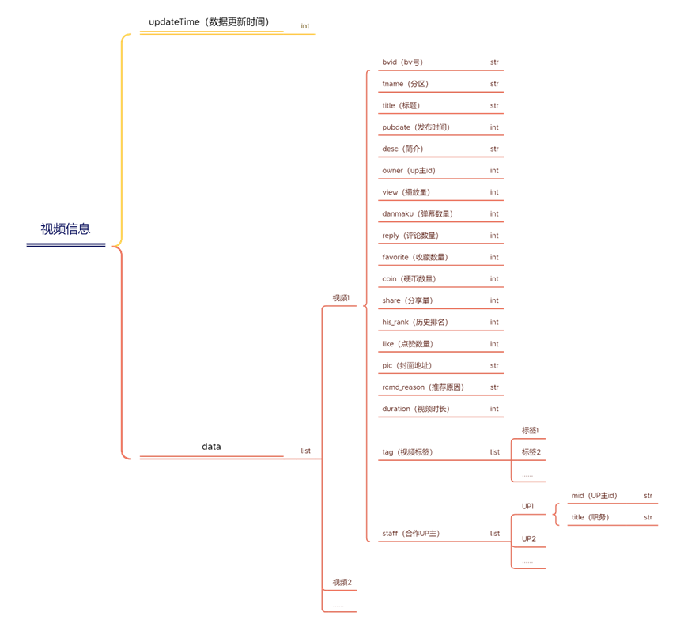
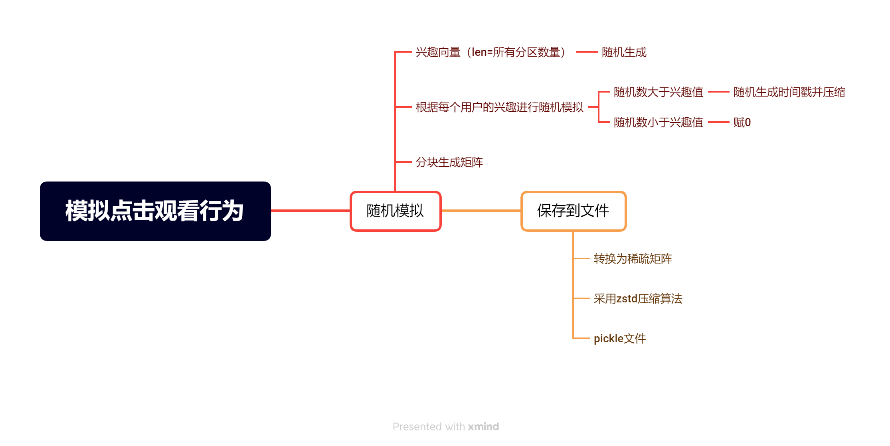
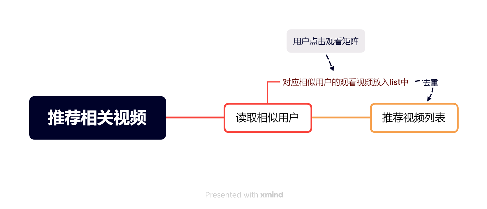
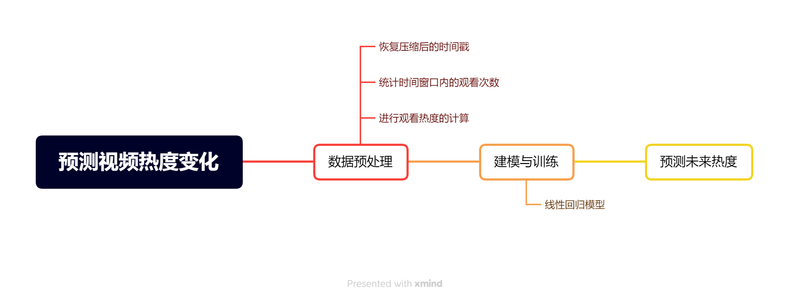
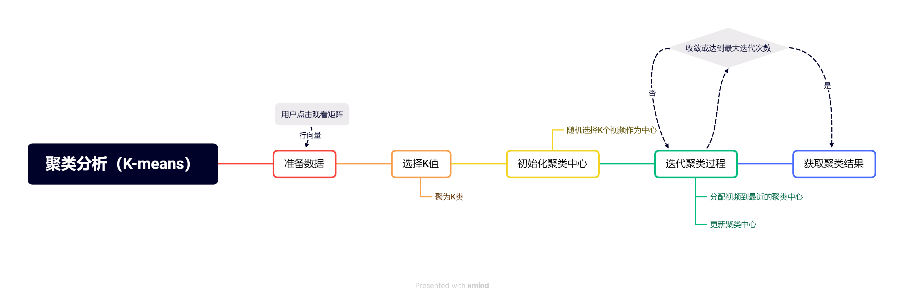

# 短视频推荐系统

完成于2023/5/20~~，不要问我为什么现在才传（~~

## 构建视频信息库（不少于10万）

采集视频时，使用由`Nemo2011`维护的python库`bilibili-api`中提供的部分api，以及python自带的`requests`库获取视频信息，包括视频的bv号、分区、标题、发布时间、简介、UP主、视频数据、封面地址、视频时长、视频标签等数据。

## **模拟点击观看行为（不少于1万）**

保存文件时，使用`pandas`库的压缩算法`zstd`进行压缩，以此减小文件体积。

## 分析相似用户

总体上，这里采用近似最近邻搜索方法（Approximate Nearest Neighbors, ANN）来得到与特定用户相似的其他用户，具体实现时，这里采用Annoy（Approximate Nearest Neighbors Oh Yeah）算法。Annoy 算法采用了二叉树这个数据结构来提升查询的效率，目标是把查询的耗时减少至`O(ln(n))`。

## **推荐相关视频**

此处采用协同过滤（Collaborative Filtering）算法来实现给特定用户推荐相关视频。

## 预测视频热度变化

这里采用线性回归模型来进行视频热度变化的预测。

## 聚类分析

这里采用K-means聚类（K-Means Cluster）的方法对视频以及用户进行聚类分析。

